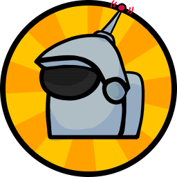
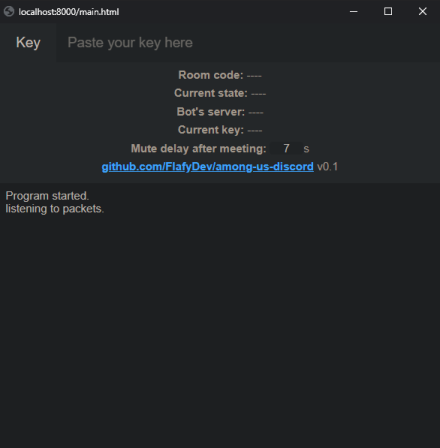

# Flafy's Among Us Bot - BETA

<p align="center">
  
</p>

**This is still in beta, so if you find any problems let me know.**  
This bot mutes discord users according to what happens in Among Us. It gets data from the game by the packets sent to/received from the server.

You can try the bot on a Discord server I created for this:  
The prefix for commands is `!au`

## Features
* Mutes and unmutes players according to what happens in Among Us(Doesn't mute dead players).
* Multiple games can run simultaneously and it's friendly with bigger servers(Wasn't tested yet).
* Everyone can start a voice channel for their game to play with anyone. No need for special permissions on the server
* Among Us codes will automatically appear in the voice channel's name so you don't have to tell it whenever someone joins the voice channel.
* Safe server mutes. The bot uses server mutes to decide who will talk at any given time. There won't be any case where a user is server muted for no reason while the bot is running.

## How does it work
#### Room
A Room is a temporary voice channel that a user creates and owns until they leave it.  
A room has a maximum of 10 users.  
For how to use the rooms do: `!au help`
#### Client
###### Currently only tested on Windows.    
Only the owner of a room must use the client.  
The client is used for the bot to know what's going on in the game.  

Download link in [releases](https://github.com/FlafyDev/among-us-discord/releases)



## Setup the bot - Medium difficulty
This bot runs a web server to communicate with the user.

The `settings.json` file must be in the bot's folder and follow this format: 
```
{
  "settings": {
    "bot_server_port": "", // Set a port to run the web server on. (blank for os.environ['PORT'])
    "bot_server_url": "https://example.com/" // Url of the bot's web server to communicate with the user.
  },

  "discord": {
    "token": "", // The Discord bot's token
    "room_creation_voice_id": "voice_channel_id", // Users must be connected to this voice channel to create a room (blank for any voice)
    "general_voice_id": "voice_channel_id", // Will move the users to here before closing the room (blank for don't move)
    "room_category_id": "category_id", // Where voice channels for rooms will be created
    "max_users_in_room": 10, // 0 for unlimited users
    "room_prefix": "『\uD83D\uDD79』" // Voice channel's names will follow this format: f"{room_prefix}{game_code}-{room_owner}"
  }
}
```

You DON'T have to build a special client to work with the bot.  
The permissions the bot requires for Discord are: `Send Messages`, `Read Text Channels & See Voice Channels`, `Manage Channels` and `Mute Members`.

## Credits
Crewmate - https://github.com/MythicManiac/Crewmate

---
#### Maybe in the future
* Only unmutes alive players when there is a meeting, ghosts(dead) players will remain muted till the game ends
* Tracks points for every imposter win(and maybe kill too?). Problems are that it can get competitive and it's easy to cheat